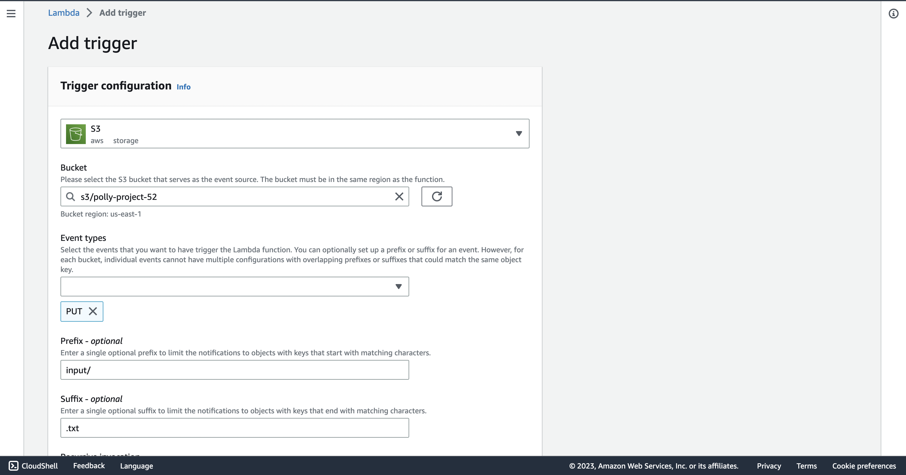

# Text-to-Speech-application-on-AWS
Text to speech convert application by using Amazon pollly,S3,Lambda

I will developing the project with @hkeremk.In this project we are going to create a project in amazon polly.Project implementing converts text into audio files by using amazon polly.A user upload a text file into the s3 then we use s3 event notification for invoking a lambda function whenever a text file is uploaded.Lambda function calls the polly apı to provide text into a speech audio stream.Then polly process the request from lambda function and returns the audio file.Lambda function saves the audio file into the output folder of the s3 bucket.

First We  create a s3 bucket and create input folder.Then upload a book summary as a object in bucket.Than create a lambda function and add a trigger from our s3 bucket.Lambda function create a new folder in s3 bucket that name output and create a json files for polly response and create a mp3 files created in polly include input text.Lambda function working process is when a text file upload in input bucket lambda function invoking and send the text file to polly than polly convert text into and mp4 files and the files uploading into an output bucket with a json document.

